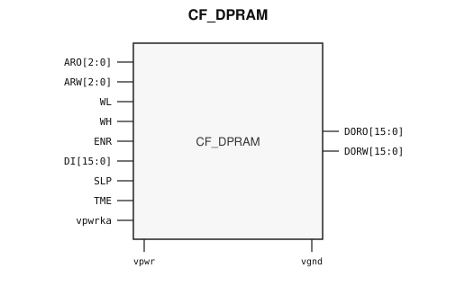

# CF_DPRAM

> Dual-port RAM (8×16)

The public GDS is an abstract; ChipFoundry
substitutes protected full geometry at tapeout.

This package ships an SRAM-style PG wrap `CF_DPRAM` around leaf
`CF_DPRAM_core`.

## Overview

`CF_DPRAM` is a SkyWater 130 nm hard-macro asynchronous dual-port RAM for
small tables, mailboxes, and coefficient storage. This drop is the 8×16
macro (3-bit addresses, 16-bit data). Instantiate `CF_DPRAM`.

Macro size is 127.295 × 62.395 µm (15 µm halo around leaf 97.295 × 32.395 µm).
Customer PG for chip PDN is `vpwr` / `vgnd`. Keep-alive `vpwrka` stays a wrap
SIGNAL port so OpenLane can route it. Well taps `vpb` / `vnb` are tied inside
the wrap.

## Installation

```bash
pip install cf-ipm
ipm install CF_DPRAM --version 0.2.2
```

Use `hdl/gl/CF_DPRAM.v` as the customer blackbox, `layout/lef/CF_DPRAM.lef`
for P&R, and `layout/gds/CF_DPRAM.gds` / `layout/mag/CF_DPRAM.mag` for the
public wrap. `CF_DPRAM_core` is the RAM leaf (empty Verilog, pin-only
abstract). ChipFoundry substitutes vault GDS into `CF_DPRAM_core` at tapeout.
P&R uses the wrap LEF (`vpwr` / `vgnd` for chip PDN). Liberty in `timing/lib/`
is rewritten onto the wrap cell. `vpwrka` is a wrap SIGNAL port, not chip PDN.

## Features

- Asynchronous 8×16 dual-port RAM (`ARO[2:0]`, `ARW[2:0]`, `DI[15:0]`, `DORO[15:0]`, `DORW[15:0]`)
- Byte write strobes `WL` / `WH`, read enable `ENR`, sleep `SLP`, test `TME`
- Customer cell `CF_DPRAM` 127.295 × 62.395 µm (15 µm halo around leaf 97.295 × 32.395 µm)
- Chip PDN is `vpwr` / `vgnd`. Keep-alive `vpwrka` stays a wrap SIGNAL port.

## Pinout

Customer documentation includes a pinout of the integration cell only.
Internal schematics and architecture block diagrams are not published.



Pin names and directions match the public wrap (`layout/lef/CF_DPRAM.lef`)
and the blackbox stub (`hdl/gl/CF_DPRAM.v`).

## Pin Description

Directions and widths are taken from the shipped Verilog in `hdl/gl/CF_DPRAM.v`.

| Name | Direction | Width | Description |
|---|---|---:|---|
| `ARO` | input | 3 | Asynchronous read address, port O. |
| `ARW` | input | 3 | Asynchronous write/read address, port W. |
| `WL` | input | 1 | Write enable, low byte (`DI[7:0]`). |
| `WH` | input | 1 | Write enable, high byte (`DI[15:8]`). |
| `ENR` | input | 1 | Read enable, port O. |
| `DI` | input | 16 | Write data, port W. |
| `DORO` | output | 16 | Read data, port O. |
| `DORW` | output | 16 | Read data, port W. |
| `SLP` | input | 1 | Sleep. |
| `TME` | input | 1 | Test-mode enable. |
| `vpwrka` | input | 1 | Keep-alive supply (wrap SIGNAL, not chip PDN). |
| `vpwr` | input | 1 | Core supply (chip PDN). |
| `vgnd` | input | 1 | Ground (chip PDN). |

`CF_DPRAM_core` also has well taps `vpb` / `vnb`. The wrap ties
`.vpb(vpwr)` and `.vnb(vgnd)`. Do not connect those pins at chip level.

In OpenLane / LibreLane, hook chip PDN with
`PDN_MACRO_CONNECTIONS: "u_cf_dpram vccd1 vssd1 vpwr vgnd"` and connect
`.vpwr(vccd1)`, `.vgnd(vssd1)` under `USE_POWER_PINS`. Route `vpwrka` to
`analog_io` (or another always-on net). Do not list `vpb` / `vnb` on the
wrapper instance.

## Specifications

Public views are an abstract for integration. Electrical numbers in Liberty
are characterized wrap-cell timing, not a datasheet replacement. The array is
8 words by 16 bits. Addresses are 3 bits. Data buses are 16 bits with separate
low-byte and high-byte write strobes. Keep-alive `vpwrka` is not on the chip
PDN mesh.

## Timing Diagram

Timing diagrams are not synthesized from stubs. Treat the array as
asynchronous: `WL` / `WH` sample `DI` at `ARW`, and `ENR` presents `ARO` on
`DORO`. Silicon access times come from Liberty, not from the ideal
behavioral model.

## Tapeout History

This hard macro has high-volume commercial production history (millions of
units). Catalog and IPM maturity is Production.

This ChipFoundry SkyWater 130 nm package delivers an abstract for
integration. ChipFoundry substitutes protected full layout at tapeout.
0.2.1 adds core `cmm1`/`cmm2` waffleDrop so fillgen does not overwrite
the array. LI fill-block remains `li1.blockage` 67/10.
0.2.2 publishes that wrap.
The chipIgnite delivery of this package is not marked shuttle-proven until
a run returns.

## Limitations and Open Issues

- Verilog in `hdl/gl/CF_DPRAM.v` is a structural wrap around an empty
  `CF_DPRAM_core` blackbox. Use `verify/beh_model/CF_DPRAM_core.v` for
  ideal functional simulation, not the empty GL stub.
- Liberty lists wrap-cell timing with well taps still present on the leaf
  model. P&R uses the wrap LEF (`vpwr` / `vgnd` for chip PDN; `vpwrka` is
  SIGNAL).
- This drop is the 8×16 macro. The power-gated `ram8x16_pg` and `fifo4x8`
  stay foundry-only.
